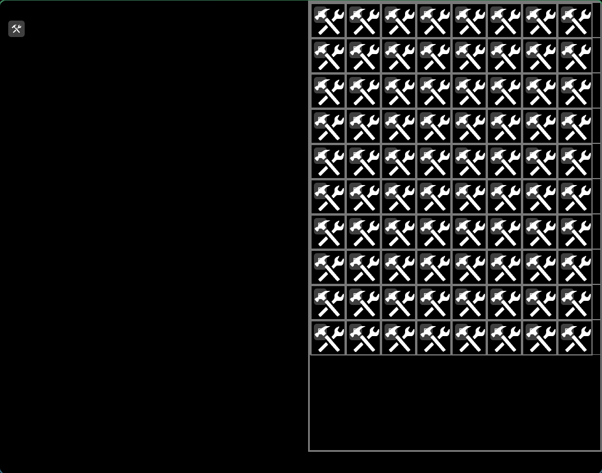
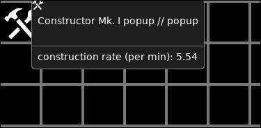

The next gap that needed to be addressed was a rudimentary inventory system.

Here is one, filled with icons:

This screenshot was taken when I was just putting the same icon in there in
repeat to test whether it works.

Here is one with a single actual item in the inventory:

Obviously lacking any polish and is only a functional proof of concept.

I also set up notifications for items being added to the inventory.

I wanted a better icon for the inventory button and found a reasonable one that
was in SVG format, but
[I had to convert it to TinyVG](../../2025-06-07-svg-to-tvg.md)

- Finally, I also added in a rudimentary tooltip for items - all function and
  barely form:
- 
