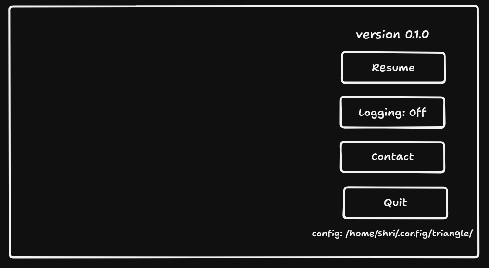
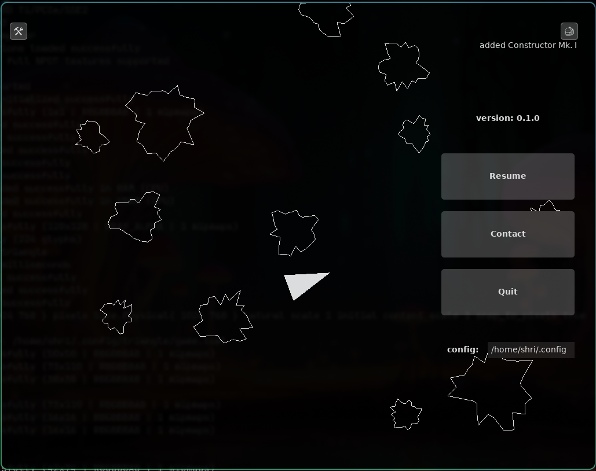

One of the key bits of functionality I want in a [sprout build](./sprout.md) is
the pause menu.

After a bit of working it out, I ended up with this plan:

Until now, hitting Escape would just exit the game immediately. Not ideal.
triangle needed a proper menu: something that pauses the game, gives players a
chance to resume or quit intentionally, and maybe even shows a bit of useful
info.

So that’s what I’ve been building. The menu now:

- Pops up when Escape is pressed (as long as no panels are open).
- Pauses the game,
- Shows a few buttons: Resume, Quit, Contact, and Config Path

## Ordering

At first, I was a bit confused as to why I was not able to see the menu. I was
under the (mistaken) impression that dvui would always draw last.

Once I switched things around to always draw dvui at the end, I could see the
menu.

## Pause/Resume

Since we use the frame time to determine how much time has passed, pausing was
simply a case of setting that time elapsed to zero.

In fact, it skips the update call altogether. One thing I noticed while I was
doing that was that the camera movement code happened in `render`. While there
is a particular logic to that, it'll need to be moved to `update` (later), at
which point, render will also not require the elapsed time.

Resume was simply a case of letting "time flow" again.

## Logging

I thought logging might be useful — but writing to file or supporting runtime
filtering requires a custom log handler. While it's probably doable, I didn’t
want to dive into it just yet. For now, I’ve left it out entirely. Maybe a
separate debug build is the better option anyway.

## Contact

I set up a form at [tally.so](https://tally.so) and ChatGPT helped me write a
tiny bit of code that opens a browser to that form.

I've not tested this on Mac/Windows and would appreciate any feedback (when a
[sprout](../sprout.md) build is available.)

## Quit

We now have a quit button that will quit the game. The game will also currently
quit if you hit `q`. I'll unmap this later.

## Config path

The config location is also displayed. The path can be selected and copied - so
that the player can navigate there easier to be able to override controls etc.

## Final

While perhaps not as pretty as the sketch (credit is more to tldraw than me), it
is functional.

Next steps are to get a dialog working with some basic information, including a
changelog and possibly a roadmap.

## Links

- [YouTube Video](../../../youtube/triangle/menu.md)
- Let's code devlogs
  - [#1.1 - Getting Started](../../../youtube/shri-codes/triangle/menus-start.md)
  - [#1.2 - Theming & More Buttons ](../../../youtube/shri-codes/triangle/menus-theming.md)
  - [#1.3 - Wiring & Finalising](../../../youtube/shri-codes/triangle/menus-finalising.md)
- Prev: [Under the Hood of Triangle](../2025-06-08-config.md)
